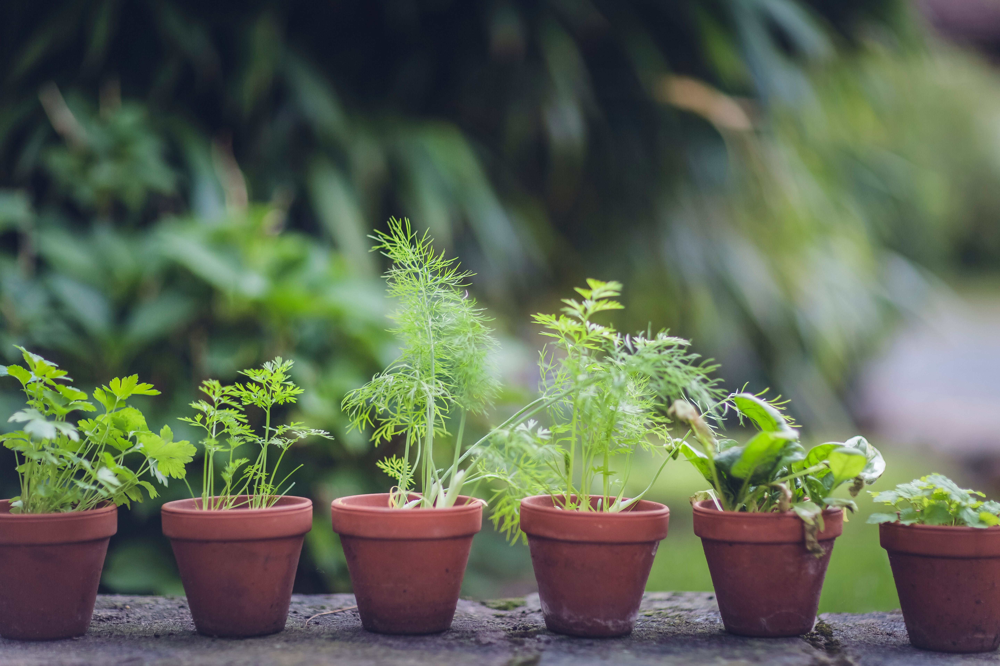

# Garden Flow

[Instalación](instalacion.md) - [Informacion](informacion.md)

## Qué es

GardenFlow es un proyecto que me gustaría llevar a cabo. Se trata de un servicio que controla el riego del jardín a través de un microcontrolador, como arduino o una rapberry pi. Donde tendremos un sensor de humedad en la planta y una válvula que abrirá el grifo cuando sea necesario. Quiero que se sea un servicio web local.

## Imágenes




## Enlaces

- [Google](https://google.com)
- [Youtube](https://youtube.com)
- [Moodle](https://moodle.org)
- [Dokcer](https://docker.com)

## Bloques de codigo

```docker
docker compose up -d
```

```html
<h1>Mi primera web</h1>
<h2>Esto es un titulo 2</h2>
```

## Tabla

| Mes                  | Conste | ¿Tenemos? | ¿Tenemos?                    |
| -------------------- | ------ | :-------: | ---------------------------- |
| Raspberry Pi Zero 2w | 50€    |    [x]    | [enlace](https://google.com) |
| Sensor humedad       | 2€     |    [ ]    | [enlace](https://google.com) |
| Electroválvula       | ---    |    [ ]    | [enlace](https://google.com) |
| Manguera             | 10€    |    [x]    | [enlace](https://google.com) |